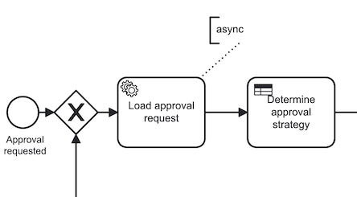

# Camunda Developer Classes

## Clone and checkout

To get your first copy, please enter

    git clone https://github.com/holisticon/camunda-dev-classes.git

Every task covered in the workshop is supported by a lab class.
**The branch X contains the solution for the class X**. To start, checkout `master` and start with `class 1`
After you are done, checkout the branch `class/1-process-model` and inspect the solution.

The following branches exist:

```bash
master
class/1-process-model
class/2-java-delegate
class/3-test-it
class/4-test-it-to-the-end
class/5-delegate-testing
class/6-automatic-approval
class/7-human-workflow
class/8-data-spin
class/9-dmn
class/10-external-task
class/10-listeners
class/11-bpmn-error
class/12-timer
class/13-messages
class/14-external-task 
class/15-camunda-bpm-data
class/16-variable-guard 
class/17-acl 
class/18-jgiven
```

Please change the branches using:

```bash
git stash

# or to keep yours
git add --all
git commit -m "my solution"

# then
git checkout class/<class-name>
```

## Building

In order to build the project, please enter

```bash
./mvnw clean install
```

## Running examples

In order to run the project, please enter

```bash
./mvnw spring-boot:run
```

### URLs

* Camunda Cockpit: http://localhost:8080/camunda/app/cockpit/default/
* Camunda Tasklist: http://localhost:8080/camunda/app/tasklist/default/
* Swagger-UI: http://localhost:8080/swagger-ui/

# Lab classes

## Class 1: Model, start, fail

In this class you will create a trivial process model in BPMN that is executed by the Camunda engine. If this process is started, the id of approval request is provided as a process variable `approvalId`. The process should load the approval for the provided id using a service task. Here is the resulting process model:


To complete this class, execute the following steps:

* Create a process model
  * Put it into (`src/main/resources/approval.bpmn`)
* Process **General Id**: `approval`
* Start event: **async after**
* Service task:
  * id: `service_load_approval_request`
  * name: `Load approval request`
  * details / implementation: `delegate expression`
  * detail / delegate expression: `${loadApprovalRequestDelegate}`
* Start process using Swagger-UI
* Inspect in Cockpit (login: admin/admin)

> All ids in process model are using **Snake Case**
> All references to code are using **Camel case**

> NOTES:
> * Check console for exception
> * Why does it happen?
> * Why async after?

## Class 2: Java Delegate

In the previous class, you referenced a bean from a service task. In this task, you will provide the implementation of this bean implemeenting a Java Delegate.

To complete this class, execute the following steps:

* Create a Spring Component
* Call it `LoadApprovalRequestDelegate`
* Implement `JavaDelegate` interface
* Start process using Swagger-UI


```java
package de.holisticon.academy.camunda.orchestration.process;

import org.camunda.bpm.engine.delegate.DelegateExecution;
import org.camunda.bpm.engine.delegate.JavaDelegate;
import org.slf4j.Logger;
import org.slf4j.LoggerFactory;
import org.springframework.stereotype.Component;

@Component("loadApprovalRequestDelegate")
public class LoadApprovalRequestDelegate implements JavaDelegate {

  private static final Logger logger = LoggerFactory.getLogger(LoadApprovalRequestDelegate.class);

  public void execute(DelegateExecution execution) {
    logger.info("Executed by process instance {}", execution.getProcessInstanceId());
  }
}
```

> NOTES:
> * See console for log

## Class 3: Test it!

* Extend the process runner skeleton
* Implement:
  * deployment test
  * process start test (async)

```java
  @Test
  public void shouldDeploy() {
    // no asserts, deployment would throw exception and fail the test on errors
  }

  @Test
  public void shouldStartWaitInApprovalRequested() {
    ProcessInstance instance = this.processBean.start();

    assertThat(instance).isNotNull();
    assertThat(instance).isWaitingAt(Elements.APPROVAL_REQUESTED);
  }
```

> NOTES:
>
> * Look on the empty test method

## Class 4: Test it to the end

```java

  @Before
  public void before() {
    // ...

    Mocks.register(Expressions.LOAD_APPROVAL_REQUEST,
      new LoadApprovalRequestDelegate());
  }

  // Extend the test
  @Test
  public void shouldStartAndLoadAndComplete() {
    ProcessInstance instance = this.processBean.start();

    assertThat(instance).isNotNull();
    assertThat(instance).isWaitingAt(Elements.APPROVAL_REQUESTED);

    execute(job());

    assertThat(instance).isEnded();
    assertThat(instance).hasPassedInOrder(
      Elements.APPROVAL_REQUESTED, Elements.LOAD_APPROVAL_REQUEST, Elements.COMPLETED);

  }
```

> NOTES:
> * Try without mock first and see what happens!

## Class 5: Delegate testing

* Delegate specification:
  * Use `ApprovalRequestRepository`
  * Load approval request by id (`Variables.APPROVAL_ID`)
  * Store amount (`Variables.AMOUNT`)
* Implement the delegate test
  * Use `Mockito.when().thenReturn()`
  * Use mocking framework: `camunda-bpm-mockito`
  * Use `DelegateExecutionFake`
  * Use Mockito `verify()`

## Class 6: Automatic approval


* Extend the process model
* Add Service task which
  * decides about approval strategy
  * automatic approval if amount < 100
* Add XOR gateway and branches
  * Use expression `${approvalStrategy == "Automatic"}`
* Test it!
* Mock delegate in process test
  * Use `CamundaMockito.registerJavaDelegateMock()`
  * Use `onExecutionSetVariables(...)`

> NOTES:
>
> * No delegate classes needed to run the process test!

## Class 7: User tasks


* Add user tasks
* Approve request
  * `task-definition-key`: `task_approve_request`
  * set variable `approvalDecision` to one of <br> `APPROVED`, `REJECTED`, `RETURNED`
* Amend request
  * `task-definition-key`: `task_amend_request`
  * set variable `amendAction` to one of <br> `CANCELLED`, `RESUBMIT`
* Test it!
* Try it
  * Use swagger endpoint
  * Check the tasklist


## Class 8: Use SPIN

```xml
<dependency>
  <groupId>org.camunda.bpm</groupId>
  <artifactId>camunda-engine-plugin-spin</artifactId>
  <version>${camunda.version}</version>
</dependency>
<dependency>
  <groupId>org.camunda.spin</groupId>
  <artifactId>camunda-spin-dataformat-json-jackson</artifactId>
  <version>${version.camunda.spin}</version>
</dependency>

```

* Modify the process and store `ApprovalRequest` as variable
* Amend the tests
  * Register plugin for SPIN

## Class 9: Business Rules with DMN

* Use business rule task for <br> `Determine approval strategy`
* Implement the DMN table
* Access `request.amount`
* Policy: First
* Use `singleEntry` as result type
* Adjust the test
 * Deploy DMN
 * Inspect the engine config
 * Remove delegate mock
 * Adjust mock for `loadRequest`

## Class 10: External Tasks

* Modify the approval process and change: "Load approval request"
* Use `External` as implementation
* Topic: `load-approval-request`
* Implement the External Task worker
  * Open Module `external-task-worker`
  * Implement `LoadApprovalRequestWorker`
  * Use `LoadApprovalRequestDelegate` as reference
* Fix `ApprovalTest`



## Class 10: Listeners

* Add audit trail listeners on en events
* Listener should log to console
* Bind as `expression` with


## Class 11: BPMN Error


* Integrate BPMN Error with fallback to manual approval
* Adjust the test
 * Add new test case
 * Change the `automatic approval delegate` stub
* Adjust `automatic approval delegate`
* Try with request `"4"`

## Class 12: Timer events


* `Amend request` task should timeout in two minutes
* Request is cancelled if timed-out
* Add a boundary timer event
* What about the test?
 * `ClockUtil#offset(Long)`

## Class 13: Messages


### Safe correlation

```java

public void correlate(String messageName, String businessKey) {
  Optional
    .ofNullable(
        this.runtimeService.createExecutionQuery()
            .processInstanceBusinessKey(businessKey)
            .messageEventSubscriptionName(messageName)
            .singleResult()
    ).ifPresent(e ->
        this.runtimeService.createMessageCorrelation(messageName)
            .processInstanceId(e.getProcessInstanceId())
            .correlate()
    );
}
```

* Start via swagger
* Checkout the Cockpit
* Implement the delegate `PlaceOrderDelegate`
 * set `delivered` to `false`
 * use correlate message
 * pass the business key
 * pass the pizza order: `type`, `size`, `delivered`
* Implement the delegate `DeliverPizzaDelegate`
 * set `delivered` to `true`
 * pass only the `delivered` back
* Checkout the tests

## Class 14: External Tasks

* Add new step: "Pack pizza" after the pizza was made
* Use `External` as implementation
* Topic: `pizzaOrder:packPizza`
* Implement the External Task worker
  * Use `ExternalTaskService`
  * Log the ordered `type`
  * Set a boolean variable: `packed`
* Fix `PizzaDeliveryProcessTest`


### External Task Process API

```java
public enum ExternalTasks {
    ;
    public enum PackPizza {
      ;
      public static final String TOPIC = "orderPizza:packPizza";

      public enum Consumes {
        ;
        public static final String TYPE = PizzaDeliveryProcess.Variables.TYPE;
      }

      public enum Produces {
        ;
        public static final String PACKED = PizzaDeliveryProcess.Variables.PACKED;
      }
    }
  }
```

```java
externalTaskService.fetchAndLock(5, WORKER_ID)
      .topic(ExternalTasks.PackPizza.TOPIC, 1000L)
      .execute()
      .forEach(it -> {
        final var type = (String) it.getVariables().get(ExternalTasks.PackPizza.Consumes.TYPE);
        // ...
        Variables.putValue(
            ExternalTasks.PackPizza.Produces.PACKED,
            true
          )
        // ...
      };
```

## Class 15: Variable access with Camunda BPM Data

* Refactor `ApprovalProcessBean.Variables`
  * Change all variables to be of type `VariableFactory<T>`
    final static variableFactory<String> APPROVAL_ID = CamundaBpmData.stringVariable("approvalId");
* Resolve all compile issues
  * Refactor delegates to use camunda-bpm-data
  * Refactor all tests
  * Try not to use `.getName()` as a quick-fix
* Use different approaches where applicable:
  * `get`, `set`, `builder`, `reader`, `writer` ...

## Class 16: Variable Guards

* Provide a Guard for "Approve request"
  * There is a failing test
  * Ensure that the task can only be completed when `APPROVAL_DECISION` is set <br>


## Class 17: Anti Corruption Layer

* Provide an Anti Corruption Layer for "Pack pizza"
  * Ensure that the ExternalTaskWorker can only complete when `PACKED` is set
  * Place it in `PizzaDeliveryProcess.ExternalTask.PackPizza`
  * Use it in the `PackPizzaExternalTaskWorker`

## Class 18: Camunda BPM JGiven

* Explore ApprovalScenarioTest
  * Not a single assert written manually --> `ThenStage` is empty!
  * Only custom steps specific for this process in `GivenWhenStage`
  * Everything else is coming from camunda-bpm-jgiven
* Complete the missing scenarios
* Run `./mvnw clean install`
* Explore the HTML report in <br>`orchestration/target/jgiven-reports/html/index.html`
